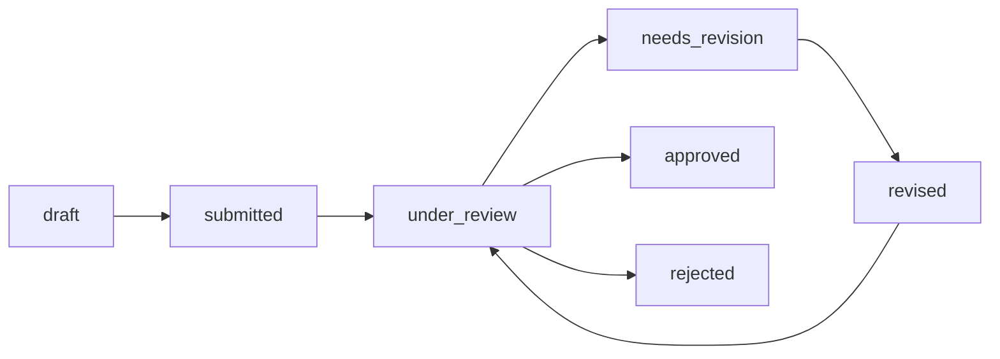

# Backend Development Guide
## PKM Review Application - NestJS Backend

> **Purpose**: This document serves as the single source of truth for backend development. Follow these guidelines to ensure consistency and alignment with the project vision.

---

## 🎯 Project Vision & Core Principles

### Application Purpose
PKM Review Application is a **multi-tenant proposal review system** where:
- **Mahasiswa** create teams and submit proposals
- **Reviewers** evaluate proposals with detailed feedback
- **Admin** manages the entire workflow

### Core Principles
1. **Security First**: Every endpoint must validate user permissions
2. **Data Integrity**: Use database constraints and validation
3. **Audit Trail**: Track all important state changes
4. **Type Safety**: Leverage TypeScript and Prisma for compile-time safety
5. **RESTful Design**: Follow REST conventions consistently

---

## 📐 Architecture Patterns

### Module-Based Architecture

Each feature is a **NestJS Module** with:
```
feature/
├── feature.module.ts       # Module definition
├── feature.controller.ts   # HTTP endpoints
├── feature.service.ts      # Business logic
├── dto/                    # Data Transfer Objects
│   ├── create-feature.dto.ts
│   └── update-feature.dto.ts
└── entities/               # (Optional) if not using Prisma types directly
```

### Dependency Injection
- Use constructor injection
- Services are `@Injectable()`
- Inject `PrismaService` for database access

### Layered Responsibilities

```
Controller → Service → Prisma → Database
    ↓          ↓
  DTOs    Business Logic
```

- **Controller**: HTTP handling, validation, serialization
- **Service**: Business logic, data orchestration
- **Prisma**: Database queries

---

## 🔐 Authentication & Authorization

### Authentication Flow
1. User login via Supabase Auth
2. Backend receives JWT token
3. `JwtGuard` validates token
4. User context attached to request

### Authorization Rules

| Role | Can Access |
|------|------------|
| **mahasiswa** | Own teams, proposals, submissions |
| **reviewer** | Assigned proposals for review |
| **admin** | All resources + system configuration |

### Implementation Pattern

```typescript
@Controller('teams')
@UseGuards(JwtAuthGuard)
export class TeamsController {
  
  @Post()
  @Roles('mahasiswa')  // Only mahasiswa can create teams
  async create(@Req() req, @Body() dto: CreateTeamDto) {
    return this.teamsService.create(req.user.mahasiswaId, dto);
  }

  @Get(':id')
  async findOne(@Req() req, @Param('id') id: string) {
    // Verify user has access to this team
    return this.teamsService.findOneForUser(req.user, id);
  }
}
```

### Critical Authorization Checks

**ALWAYS verify**:
- Mahasiswa can only access their own teams
- Reviewer can only access assigned proposals
- Admin operations require admin role

---

## 📋 Business Rules (MUST FOLLOW)

### Team Management
- ✅ Team must have 3-5 members (validated at creation)
- ✅ One mahasiswa can join max 2 teams per period
- ✅ Team creator becomes `ketua` automatically
- ✅ Cannot delete team if proposal exists

### Proposal Workflow
1. **Draft** → Mahasiswa uploads initial proposal
2. **Submitted** → Mahasiswa submits for review
3. **Under Review** → Assigned to 2 reviewers
4. **Needs Revision** → If any reviewer marks it
5. **Approved** → If both reviewers approve
6. **Rejected** → If both reviewers reject

**Rules**:
- Cannot submit if no file uploaded
- Cannot modify submitted proposal
- Status changes must follow sequence
- Admin can force status change

### Review Assignment
- Each proposal gets **exactly 2 reviewers**
- Reviewers assigned by admin
- Cannot reassign after review started
- Both reviewers must complete before final status

### File Upload
- **Max size**: 10MB
- **Type**: PDF only
- **Naming**: `{team_id}_{timestamp}_{original_name}.pdf`
- **Storage**: Supabase Storage buckets

---

## 🗃️ Database Access Patterns

### Use Prisma Correctly

**Good** ✅:
```typescript
// Include relations
const team = await this.prisma.team.findUnique({
  where: { id: BigInt(teamId) },
  include: {
    teamMembers: {
      include: { mahasiswa: true }
    },
    proposals: true
  }
});

// Transaction for atomic operations
await this.prisma.$transaction(async (tx) => {
  const team = await tx.team.create({ data: teamData });
  await tx.teamMember.create({ data: memberData });
});
```

**Bad** ❌:
```typescript
// N+1 query problem
const teams = await this.prisma.team.findMany();
for (const team of teams) {
  const members = await this.prisma.teamMember.findMany({
    where: { teamId: team.id }
  });
}

// Missing transaction
const team = await this.prisma.team.create({ data: teamData });
await this.prisma.teamMember.create({ data: memberData }); // Can fail leaving inconsistent state
```

### BigInt Handling

Prisma uses `BigInt` for IDs. Convert carefully:

```typescript
// From request params (string)
const teamId = BigInt(params.id);

// To JSON response
return {
  id: team.id.toString(),  // Convert BigInt to string
  name: team.namaTeam
};
```

---

## 📝 DTO Patterns & Validation

### Create DTOs with Class-Validator

```typescript
import { IsString, IsNotEmpty, MinLength, MaxLength, IsOptional } from 'class-validator';
import { Type } from 'class-transformer';

export class CreateTeamDto {
  @IsString()
  @IsNotEmpty()
  @MinLength(3)
  @MaxLength(255)
  namaTeam: string;

  @IsString()
  @IsNotEmpty()
  @MinLength(10)
  judulProposal: string;

  @Type(() => String)
  jenisPkmId: string;  // Will be converted to BigInt in service

  @IsOptional()
  @Type(() => String)
  dosenPembimbingId?: string;
}
```

### Validation Rules

| Field Type | Validators |
|---|---|
| Required String | `@IsString()`, `@IsNotEmpty()`, `@MinLength()`, `@MaxLength()` |
| Optional String | `@IsOptional()`, `@IsString()` |
| Email | `@IsEmail()` |
| Number | `@IsNumber()`, `@Min()`, `@Max()` |
| Enum | `@IsEnum(EnumType)` |
| Date | `@IsDateString()` or `@Type(() => Date)` |

---

## 🔄 Status Management

### Proposal Status Transitions



**Validation**:
```typescript
const validTransitions = {
  'draft': ['submitted'],
  'submitted': ['under_review'],
  'under_review': ['needs_revision', 'approved', 'rejected'],
  'needs_revision': ['revised'],
  'revised': ['under_review']
};

function canTransition(from: string, to: string): boolean {
  return validTransitions[from]?.includes(to) ?? false;
}
```

---

## 🚨 Error Handling

### Standard Error Responses

```typescript
// Bad Request (400)
throw new BadRequestException('Team name already exists');

// Unauthorized (401)
throw new UnauthorizedException('Invalid credentials');

// Forbidden (403)
throw new ForbiddenException('You do not have access to this resource');

// Not Found (404)
throw new NotFoundException(`Team with ID ${id} not found`);

// Conflict (409)
throw new ConflictException('Duplicate entry');

// Internal Server Error (500)
throw new InternalServerErrorException('Something went wrong');
```

### Try-Catch Pattern

```typescript
async createTeam(userId: string, dto: CreateTeamDto) {
  try {
    return await this.prisma.$transaction(async (tx) => {
      // Business logic
    });
  } catch (error) {
    if (error instanceof Prisma.PrismaClientKnownRequestError) {
      if (error.code === 'P2002') {
        throw new ConflictException('Unique constraint violation');
      }
    }
    throw new InternalServerErrorException('Failed to create team');
  }
}
```

---

## 📊 API Response Conventions

### Success Response

```typescript
// Single resource
{
  "id": "123",
  "namaTeam": "Team Alpha",
  "createdAt": "2026-02-04T12:00:00Z"
}

// List of resources
{
  "data": [...],
  "meta": {
    "total": 100,
    "page": 1,
    "perPage": 20
  }
}
```

### Error Response

```typescript
{
  "statusCode": 400,
  "message": "Validation failed",
  "error": "Bad Request",
  "details": [
    {
      "field": "namaTeam",
      "message": "namaTeam must be at least 3 characters"
    }
  ]
}
```

---

## 🧪 Testing Guidelines

### Unit Tests (Services)

```typescript
describe('TeamsService', () => {
  let service: TeamsService;
  let prisma: PrismaService;

  beforeEach(async () => {
    const module = await Test.createTestingModule({
      providers: [TeamsService, PrismaService],
    }).compile();

    service = module.get<TeamsService>(TeamsService);
    prisma = module.get<PrismaService>(PrismaService);
  });

  it('should create a team', async () => {
    // Mock Prisma
    jest.spyOn(prisma.team, 'create').mockResolvedValue(mockTeam);
    
    const result = await service.create(userId, dto);
    expect(result).toEqual(mockTeam);
  });
});
```

### Integration Tests (E2E)

```typescript
describe('Teams (e2e)', () => {
  it('/teams (POST)', () => {
    return request(app.getHttpServer())
      .post('/teams')
      .set('Authorization', `Bearer ${jwtToken}`)
      .send(createTeamDto)
      .expect(201)
      .expect((res) => {
        expect(res.body.namaTeam).toEqual(createTeamDto.namaTeam);
      });
  });
});
```

---

## 📌 Development Checklist

Before implementing a new feature:

- [ ] Read PRD for business requirements
- [ ] Check database schema (Prisma schema)
- [ ] Define DTOs with validation
- [ ] Implement service with business logic
- [ ] Add authorization checks
- [ ] Handle errors properly
- [ ] Test with different user roles
- [ ] Document endpoint in Swagger
- [ ] Update API specification doc

---

## 🎯 Don't Hallucinate - Follow These Rules

### 1. **Never bypass authorization**
Even if it seems convenient, ALWAYS check user permissions.

### 2. **Validate all inputs**
Use DTOs with class-validator. Don't trust client data.

### 3. **Use transactions for multi-step operations**
If creating team + member, wrap in `$transaction`.

### 4. **Follow naming conventions**
- Controllers: `feature.controller.ts`
- Services: `feature.service.ts`
- DTOs: `create-feature.dto.ts`
- Modules: `feature.module.ts`

### 5. **Don't modify Prisma schema without migration**
Always run `npx prisma migrate dev` after schema changes.

### 6. **Log important events**
Use `Logger` for debugging and audit trail.

### 7. **Return meaningful errors**
Don't expose internal errors to client. Use appropriate HTTP status codes.

### 8. **Test edge cases**
- Empty strings
- Null values
- Invalid IDs
- Unauthorized access
- Concurrent modifications

---

## 🔗 Related Documentation

- [Prisma Schema](../prisma/schema.prisma)
- [API Specification](../documents/api_specification.md)
- [Database Schema](../documents/database_schema.md)
- [PRD](../documents/prd.md)

---

**When in doubt, refer back to this guide and the PRD. Consistency is key!** 🚀
