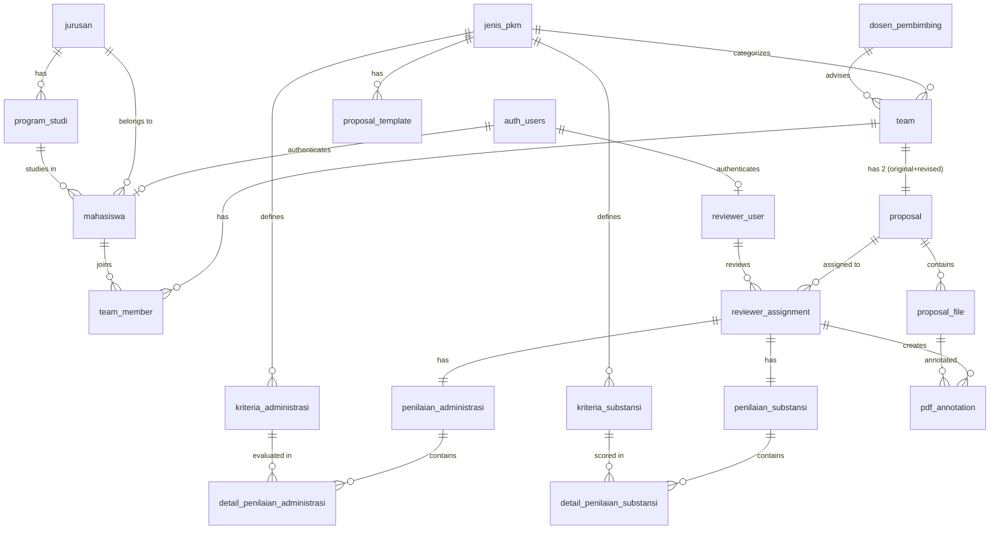

# Database Schema Design
## PKM Review Application - New Schema

**Version**: 1.0  
**Date**: 2026-02-02  
**Database**: PostgreSQL with Supabase Auth  
**ORM**: Prisma (Recommended)

---

## Design Decisions Summary

### Key Architectural Decisions
1. **Authentication**: Supabase Auth (`auth.users` schema)
2. **Login Method**: Email + Password (NOT NIM)
3. **Proposals per Team**: 2 proposals (original + revised for documentation)
4. **File Storage**: Supabase Storage
5. **File Versioning**: 2 versions permanent (original + revised)
6. **Review Frequency**: 1x review only (on original proposal)
7. **Annotation Format**: JSON field for coordinates and metadata
8. **Delete Strategy**: Hard delete with CASCADE
9. **Timestamps**: WITHOUT time zone (assume UTC)
10. **Audit Trail**: created_at, updated_at, created_by, updated_by

---

## Schema Overview

### Total Tables: 20

**Core Tables** (7):
- `mahasiswa`, `reviewer_user`, `dosen_pembimbing`, `team`, `team_member`, `proposal`, `proposal_file`

**Assessment Tables** (6):
- `reviewer_assignment`, `penilaian_administrasi`, `detail_penilaian_administrasi`, `penilaian_substansi`, `detail_penilaian_substansi`, `pdf_annotation`

**Master Data** (5):
- `jenis_pkm`, `jurusan`, `program_studi`, `kriteria_administrasi`, `kriteria_substansi`

**Configuration** (2):
- `system_config`, `proposal_template`

---

## Table Definitions

### 1. **mahasiswa** (Students)
Links to Supabase auth.users for authentication.

```sql
CREATE TABLE mahasiswa (
    id BIGSERIAL PRIMARY KEY,
    user_id UUID NOT NULL UNIQUE REFERENCES auth.users(id) ON DELETE CASCADE,
    nama VARCHAR(255) NOT NULL,
    nim VARCHAR(12) NOT NULL UNIQUE,
    email VARCHAR(255) NOT NULL UNIQUE,
    no_hp VARCHAR(20),
    jurusan_id BIGINT NOT NULL REFERENCES jurusan(id) ON DELETE CASCADE,
    program_studi_id BIGINT NOT NULL REFERENCES program_studi(id) ON DELETE CASCADE,
    created_at TIMESTAMP NOT NULL DEFAULT NOW(),
    updated_at TIMESTAMP NOT NULL DEFAULT NOW(),
    created_by UUID REFERENCES auth.users(id),
    updated_by UUID REFERENCES auth.users(id),
    
    CONSTRAINT nim_format CHECK (nim ~ '^[0-9]{12}$')
);

CREATE INDEX idx_mahasiswa_user_id ON mahasiswa(user_id);
CREATE INDEX idx_mahasiswa_nim ON mahasiswa(nim);
CREATE INDEX idx_mahasiswa_email ON mahasiswa(email);
CREATE INDEX idx_mahasiswa_jurusan_id ON mahasiswa(jurusan_id);
CREATE INDEX idx_mahasiswa_program_studi_id ON mahasiswa(program_studi_id);
```

**Notes**:
- `user_id` links to `auth.users` (Supabase auth table)
- `nim` has CHECK constraint for 12 digits
- Login via email+password (handled by Supabase Auth)
- `email` must match email in `auth.users`

---

### 2. **reviewer_user** (Reviewer/Dosen with Login)
Dosen yang memiliki akun dan bisa login untuk review.

```sql
CREATE TABLE reviewer_user (
    id BIGSERIAL PRIMARY KEY,
    user_id UUID NOT NULL UNIQUE REFERENCES auth.users(id) ON DELETE CASCADE,
    nama VARCHAR(255) NOT NULL,
    nidn VARCHAR(20),
    email VARCHAR(255) NOT NULL UNIQUE,
    no_hp VARCHAR(20),
    created_at TIMESTAMP NOT NULL DEFAULT NOW(),
    updated_at TIMESTAMP NOT NULL DEFAULT NOW(),
    created_by UUID REFERENCES auth.users(id),
    updated_by UUID REFERENCES auth.users(id)
);

CREATE INDEX idx_reviewer_user_user_id ON reviewer_user(user_id);
CREATE INDEX idx_reviewer_user_email ON reviewer_user(email);
```

**Notes**:
- Separate from `dosen_pembimbing` (which is text data only)
- Cannot be pembimbing for any team (business rule enforced at app level)
- Links to `auth.users` for authentication

---

### 3. **dosen_pembimbing** (Advisor - Text Data Only)
Dosen pembimbing yang diinput mahasiswa, tidak bisa login.

```sql
CREATE TABLE dosen_pembimbing (
    id BIGSERIAL PRIMARY KEY,
    nama VARCHAR(255) NOT NULL,
    nidn VARCHAR(20),
    email VARCHAR(255),
    no_hp VARCHAR(20),
    created_at TIMESTAMP NOT NULL DEFAULT NOW(),
    updated_at TIMESTAMP NOT NULL DEFAULT NOW(),
    created_by UUID REFERENCES auth.users(id),
    updated_by UUID REFERENCES auth.users(id)
);

CREATE INDEX idx_dosen_pembimbing_nama ON dosen_pembimbing(nama);
```

**Notes**:
- No `user_id` - this is NOT a user account
- Mahasiswa can create new `dosen_pembimbing` if name doesn't exist
- Same dosen name can exist multiple times (no unique constraint)

---

### 4. **jurusan** (Department Master Data)

```sql
CREATE TABLE jurusan (
    id BIGSERIAL PRIMARY KEY,
    nama VARCHAR(255) NOT NULL UNIQUE,
    created_at TIMESTAMP NOT NULL DEFAULT NOW(),
    updated_at TIMESTAMP NOT NULL DEFAULT NOW(),
    created_by UUID REFERENCES auth.users(id),
    updated_by UUID REFERENCES auth.users(id)
);
```

---

### 5. **program_studi** (Study Program Master Data)

```sql
CREATE TABLE program_studi (
    id BIGSERIAL PRIMARY KEY,
    jurusan_id BIGINT NOT NULL REFERENCES jurusan(id) ON DELETE CASCADE,
    nama VARCHAR(255) NOT NULL,
    created_at TIMESTAMP NOT NULL DEFAULT NOW(),
    updated_at TIMESTAMP NOT NULL DEFAULT NOW(),
    created_by UUID REFERENCES auth.users(id),
    updated_by UUID REFERENCES auth.users(id),
    
    UNIQUE(jurusan_id, nama)
);

CREATE INDEX idx_program_studi_jurusan_id ON program_studi(jurusan_id);
```

**Notes**:
- 1 Jurusan has many Program Studi
- Unique constraint on (jurusan_id, nama) to prevent duplicate prodi names within same jurusan

---

### 6. **jenis_pkm** (PKM Type/Category)

```sql
CREATE TABLE jenis_pkm (
    id BIGSERIAL PRIMARY KEY,
    nama VARCHAR(100) NOT NULL UNIQUE,
    kode VARCHAR(20) UNIQUE,
    deskripsi TEXT,
    created_at TIMESTAMP NOT NULL DEFAULT NOW(),
    updated_at TIMESTAMP NOT NULL DEFAULT NOW(),
    created_by UUID REFERENCES auth.users(id),
    updated_by UUID REFERENCES auth.users(id)
);
```

**Examples**: PKM-RE, PKM-RSH, PKM-PM, PKM-KC, PKM-AI, PKM-GFT, PKM-K

---

### 7. **team** (Team Management)

```sql
CREATE TYPE team_status_enum AS ENUM ('active', 'inactive');

CREATE TABLE team (
    id BIGSERIAL PRIMARY KEY,
    nama_team VARCHAR(255) NOT NULL,
    judul_proposal TEXT NOT NULL,
    jenis_pkm_id BIGINT NOT NULL REFERENCES jenis_pkm(id) ON DELETE CASCADE,
    dosen_pembimbing_id BIGINT REFERENCES dosen_pembimbing(id) ON DELETE SET NULL,
    status team_status_enum NOT NULL DEFAULT 'active',
    created_at TIMESTAMP NOT NULL DEFAULT NOW(),
    updated_at TIMESTAMP NOT NULL DEFAULT NOW(),
    created_by UUID REFERENCES auth.users(id),
    updated_by UUID REFERENCES auth.users(id)
);

CREATE INDEX idx_team_jenis_pkm_id ON team(jenis_pkm_id);
CREATE INDEX idx_team_dosen_pembimbing_id ON team(dosen_pembimbing_id);
CREATE INDEX idx_team_status ON team(status);
```

**Notes**:
- `dosen_pembimbing_id` is optional at creation, required before submit
- `status` untuk track active/inactive team
- ON DELETE CASCADE for `jenis_pkm_id` (if PKM type deleted, team deleted)
- ON DELETE SET NULL for `dosen_pembimbing_id` (if pembimbing deleted, team keeps but pembimbing = null)

---

### 8. **team_member** (Team Membership)

```sql
CREATE TYPE member_role_enum AS ENUM ('ketua', 'anggota');

CREATE TABLE team_member (
    id BIGSERIAL PRIMARY KEY,
    team_id BIGINT NOT NULL REFERENCES team(id) ON DELETE CASCADE,
    mahasiswa_id BIGINT NOT NULL REFERENCES mahasiswa(id) ON DELETE CASCADE,
    role member_role_enum NOT NULL DEFAULT 'anggota',
    joined_at TIMESTAMP NOT NULL DEFAULT NOW(),
    created_at TIMESTAMP NOT NULL DEFAULT NOW(),
    updated_at TIMESTAMP NOT NULL DEFAULT NOW(),
    
    UNIQUE(team_id, mahasiswa_id)
);

CREATE INDEX idx_team_member_team_id ON team_member(team_id);
CREATE INDEX idx_team_member_mahasiswa_id ON team_member(mahasiswa_id);
```

**Notes**:
- Unique constraint to prevent duplicate membership
- Role is just a label (no permission difference)
- Min 3 members to submit proposal (enforced at app level)
- Max 5 members (enforced at app level)

---

### 9. **proposal** (Proposals)

```sql
CREATE TYPE proposal_status_enum AS ENUM (
    'draft',
    'submitted',
    'under_review',
    'reviewed',
    'sudah_di_revisi'
);

CREATE TYPE proposal_type_enum AS ENUM (
    'original',
    'revised'
);

CREATE TABLE proposal (
    id BIGSERIAL PRIMARY KEY,
    team_id BIGINT NOT NULL REFERENCES team(id) ON DELETE CASCADE,
    type proposal_type_enum NOT NULL,
    status proposal_status_enum NOT NULL DEFAULT 'draft',
    created_at TIMESTAMP NOT NULL DEFAULT NOW(),
    updated_at TIMESTAMP NOT NULL DEFAULT NOW(),
    created_by UUID REFERENCES auth.users(id),
    updated_by UUID REFERENCES auth.users(id),
    
    UNIQUE(team_id, type)
);

CREATE INDEX idx_proposal_team_id ON proposal(team_id);
CREATE INDEX idx_proposal_status ON proposal(status);
CREATE INDEX idx_proposal_type ON proposal(type);
```

**Notes**:
- 1 team has 2 proposals: `original` and `revised`
- UNIQUE(team_id, type) ensures only 1 original and 1 revised per team
- `revised` proposal is for documentation only (no review)
- Status workflow applies to both proposals independently

---

### 10. **proposal_file** (File Storage Tracking)

```sql
CREATE TABLE proposal_file (
    id BIGSERIAL PRIMARY KEY,
    proposal_id BIGINT NOT NULL REFERENCES proposal(id) ON DELETE CASCADE,
    file_path VARCHAR(500) NOT NULL,
    file_name VARCHAR(255) NOT NULL,
    file_size BIGINT NOT NULL,
    mime_type VARCHAR(100) NOT NULL DEFAULT 'application/pdf',
    uploaded_by UUID NOT NULL REFERENCES auth.users(id),
    uploaded_at TIMESTAMP NOT NULL DEFAULT NOW(),
    created_at TIMESTAMP NOT NULL DEFAULT NOW()
);

CREATE INDEX idx_proposal_file_proposal_id ON proposal_file(proposal_id);
CREATE INDEX idx_proposal_file_uploaded_by ON proposal_file(uploaded_by);
```

**Notes**:
- `file_path` points to Supabase Storage bucket path
- Each proposal can have multiple file uploads (for re-upload scenario)
- File size max 10MB (enforced at app level, not DB constraint for flexibility)

---

### 11. **reviewer_assignment** (Reviewer Assignment to Proposal)

```sql
CREATE TABLE reviewer_assignment (
    id BIGSERIAL PRIMARY KEY,
    proposal_id BIGINT NOT NULL REFERENCES proposal(id) ON DELETE CASCADE,
    reviewer_user_id BIGINT NOT NULL REFERENCES reviewer_user(id) ON DELETE CASCADE,
    reviewer_number SMALLINT NOT NULL CHECK (reviewer_number IN (1, 2)),
    assigned_at TIMESTAMP NOT NULL DEFAULT NOW(),
    assigned_by UUID NOT NULL REFERENCES auth.users(id),
    created_at TIMESTAMP NOT NULL DEFAULT NOW(),
    
    UNIQUE(proposal_id, reviewer_number)
);

CREATE INDEX idx_reviewer_assignment_proposal_id ON reviewer_assignment(proposal_id);
CREATE INDEX idx_reviewer_assignment_reviewer_user_id ON reviewer_assignment(reviewer_user_id);
```

**Notes**:
- 2 reviewers per proposal (reviewer_number: 1 or 2)
- UNIQUE(proposal_id, reviewer_number) ensures exactly 2 reviewers
- Only assigned to `original` proposal (revised has no review)
- Same reviewer for both proposals if needed (enforced at app level)

---

### 12. **kriteria_administrasi** (Administrative Checklist Criteria)

```sql
CREATE TABLE kriteria_administrasi (
    id BIGSERIAL PRIMARY KEY,
    jenis_pkm_id BIGINT NOT NULL REFERENCES jenis_pkm(id) ON DELETE CASCADE,
    deskripsi TEXT NOT NULL,
    urutan INTEGER,
    created_at TIMESTAMP NOT NULL DEFAULT NOW(),
    updated_at TIMESTAMP NOT NULL DEFAULT NOW(),
    created_by UUID REFERENCES auth.users(id),
    updated_by UUID REFERENCES auth.users(id)
);

CREATE INDEX idx_kriteria_administrasi_jenis_pkm_id ON kriteria_administrasi(jenis_pkm_id);
```

**Notes**:
- Criteria are specific to each `jenis_pkm`
- Admin can CRUD dynamically
- `urutan` for display order

**Example Criteria**:
- "Margin tidak sesuai (Top: 3cm, Left: 4cm, Right: 3cm, Bottom: 3cm)"
- "Jumlah halaman melebihi 15 halaman"
- "Struktur proposal tidak lengkap"

---

### 13. **kriteria_substansi** (Substantive Scoring Criteria)

```sql
CREATE TABLE kriteria_substansi (
    id BIGSERIAL PRIMARY KEY,
    jenis_pkm_id BIGINT NOT NULL REFERENCES jenis_pkm(id) ON DELETE CASCADE,
    nama VARCHAR(255) NOT NULL,
    deskripsi TEXT,
    skor_min INTEGER NOT NULL DEFAULT 0,
    skor_max INTEGER NOT NULL,
    bobot DECIMAL(5,2),
    urutan INTEGER,
    created_at TIMESTAMP NOT NULL DEFAULT NOW(),
    updated_at TIMESTAMP NOT NULL DEFAULT NOW(),
    created_by UUID REFERENCES auth.users(id),
    updated_by UUID REFERENCES auth.users(id),
    
    CHECK (skor_min < skor_max),
    CHECK (bobot >= 0 AND bobot <= 100)
);

CREATE INDEX idx_kriteria_substansi_jenis_pkm_id ON kriteria_substansi(jenis_pkm_id);
```

**Notes**:
- Criteria specific to each `jenis_pkm`
- `skor_min`, `skor_max` define score range (e.g., 0-10, 0-100)
- `bobot` is optional weight percentage
- `urutan` for display order

**Example Criteria**:
- "Originalitas Ide" (0-20)
- "Metodologi Penelitian" (0-30)
- "Kelayakan Program" (0-25)
- "Dampak dan Manfaat" (0-25)

---

### 14. **penilaian_administrasi** (Administrative Assessment)

```sql
CREATE TABLE penilaian_administrasi (
    id BIGSERIAL PRIMARY KEY,
    reviewer_assignment_id BIGINT NOT NULL UNIQUE REFERENCES reviewer_assignment(id) ON DELETE CASCADE,
    total_kesalahan INTEGER NOT NULL DEFAULT 0,
    catatan TEXT,
    is_complete BOOLEAN NOT NULL DEFAULT FALSE,
    created_at TIMESTAMP NOT NULL DEFAULT NOW(),
    updated_at TIMESTAMP NOT NULL DEFAULT NOW()
);

CREATE INDEX idx_penilaian_administrasi_reviewer_assignment_id ON penilaian_administrasi(reviewer_assignment_id);
```

**Notes**:
- 1 penilaian per reviewer assignment (1:1 relationship)
- `is_complete` indicates if reviewer finished (replaces old `status` boolean)
- `total_kesalahan` auto-calculated from detail count

---

### 15. **detail_penilaian_administrasi** (Administrative Assessment Details)

```sql
CREATE TABLE detail_penilaian_administrasi (
    id BIGSERIAL PRIMARY KEY,
    penilaian_administrasi_id BIGINT NOT NULL REFERENCES penilaian_administrasi(id) ON DELETE CASCADE,
    kriteria_administrasi_id BIGINT NOT NULL REFERENCES kriteria_administrasi(id) ON DELETE CASCADE,
    ada_kesalahan BOOLEAN NOT NULL DEFAULT FALSE,
    created_at TIMESTAMP NOT NULL DEFAULT NOW(),
    updated_at TIMESTAMP NOT NULL DEFAULT NOW(),
    
    UNIQUE(penilaian_administrasi_id, kriteria_administrasi_id)
);

CREATE INDEX idx_detail_penilaian_administrasi_penilaian_id ON detail_penilaian_administrasi(penilaian_administrasi_id);
CREATE INDEX idx_detail_penilaian_administrasi_kriteria_id ON detail_penilaian_administrasi(kriteria_administrasi_id);
```

**Notes**:
- Links penilaian to each kriteria
- `ada_kesalahan = TRUE` means this criteria has an error
- UNIQUE constraint prevents duplicate entries

---

### 16. **penilaian_substansi** (Substantive Assessment)

```sql
CREATE TABLE penilaian_substansi (
    id BIGSERIAL PRIMARY KEY,
    reviewer_assignment_id BIGINT NOT NULL UNIQUE REFERENCES reviewer_assignment(id) ON DELETE CASCADE,
    total_skor DECIMAL(10,2) NOT NULL DEFAULT 0,
    catatan TEXT,
    is_complete BOOLEAN NOT NULL DEFAULT FALSE,
    created_at TIMESTAMP NOT NULL DEFAULT NOW(),
    updated_at TIMESTAMP NOT NULL DEFAULT NOW()
);

CREATE INDEX idx_penilaian_substansi_reviewer_assignment_id ON penilaian_substansi(reviewer_assignment_id);
```

**Notes**:
- 1 penilaian per reviewer assignment (1:1 relationship)
- `total_skor` auto-calculated from detail scores
- `is_complete` indicates if reviewer finished

---

### 17. **detail_penilaian_substansi** (Substantive Assessment Details)

```sql
CREATE TABLE detail_penilaian_substansi (
    id BIGSERIAL PRIMARY KEY,
    penilaian_substansi_id BIGINT NOT NULL REFERENCES penilaian_substansi(id) ON DELETE CASCADE,
    kriteria_substansi_id BIGINT NOT NULL REFERENCES kriteria_substansi(id) ON DELETE CASCADE,
    skor DECIMAL(10,2) NOT NULL,
    created_at TIMESTAMP NOT NULL DEFAULT NOW(),
    updated_at TIMESTAMP NOT NULL DEFAULT NOW(),
    
    UNIQUE(penilaian_substansi_id, kriteria_substansi_id)
);

CREATE INDEX idx_detail_penilaian_substansi_penilaian_id ON detail_penilaian_substansi(penilaian_substansi_id);
CREATE INDEX idx_detail_penilaian_substansi_kriteria_id ON detail_penilaian_substansi(kriteria_substansi_id);
```

**Notes**:
- Links penilaian to each kriteria
- `skor` must be within `skor_min` and `skor_max` of kriteria (enforced at app level)
- UNIQUE constraint prevents duplicate entries

---

### 18. **pdf_annotation** (PDF Highlights & Comments)

```sql
CREATE TYPE annotation_type_enum AS ENUM ('highlight', 'comment');

CREATE TABLE pdf_annotation (
    id BIGSERIAL PRIMARY KEY,
    proposal_file_id BIGINT NOT NULL REFERENCES proposal_file(id) ON DELETE CASCADE,
    reviewer_assignment_id BIGINT NOT NULL REFERENCES reviewer_assignment(id) ON DELETE CASCADE,
    type annotation_type_enum NOT NULL,
    page_number INTEGER NOT NULL,
    annotation_data JSONB NOT NULL,
    created_at TIMESTAMP NOT NULL DEFAULT NOW(),
    updated_at TIMESTAMP NOT NULL DEFAULT NOW()
);

CREATE INDEX idx_pdf_annotation_proposal_file_id ON pdf_annotation(proposal_file_id);
CREATE INDEX idx_pdf_annotation_reviewer_assignment_id ON pdf_annotation(reviewer_assignment_id);
CREATE INDEX idx_pdf_annotation_page_number ON pdf_annotation(page_number);
CREATE INDEX idx_pdf_annotation_data ON pdf_annotation USING GIN(annotation_data);
```

**JSONB annotation_data format**:
```json
{
  "coordinates": {
    "x": 100,
    "y": 200,
    "width": 150,
    "height": 20
  },
  "text": "Text yang di-highlight atau komentar",
  "color": "#FFFF00",
  "reviewer_number": 1
}
```

**Notes**:
- `annotation_data` stores all annotation metadata as JSON
- GIN index on JSONB for fast queries
- `reviewer_number` in JSON to visually distinguish reviewers

---

### 19. **system_config** (System Configuration & Toggles)

```sql
CREATE TABLE system_config (
    id BIGSERIAL PRIMARY KEY,
    config_key VARCHAR(100) NOT NULL UNIQUE,
    config_value JSONB NOT NULL,
    deskripsi TEXT,
    created_at TIMESTAMP NOT NULL DEFAULT NOW(),
    updated_at TIMESTAMP NOT NULL DEFAULT NOW(),
    updated_by UUID REFERENCES auth.users(id)
);

CREATE INDEX idx_system_config_key ON system_config(config_key);
```

**Example Configuration Keys**:
```json
{
  "toggle_pengumpulan": { "enabled": true },
  "toggle_review": { "enabled": false },
  "toggle_upload_ulang": { "enabled": false },
  "max_file_size_mb": { "value": 10 },
  "min_team_members": { "value": 3 },
  "max_team_members": { "value": 5 }
}
```

**Notes**:
- Flexible key-value configuration
- `config_value` as JSONB allows complex configuration objects
- Admin can add/edit config via UI

---

### 20. **proposal_template** (Optional Proposal Templates)

```sql
CREATE TABLE proposal_template (
    id BIGSERIAL PRIMARY KEY,
    jenis_pkm_id BIGINT NOT NULL REFERENCES jenis_pkm(id) ON DELETE CASCADE,
    nama_template VARCHAR(255) NOT NULL,
    file_path VARCHAR(500) NOT NULL,
    file_name VARCHAR(255) NOT NULL,
    deskripsi TEXT,
    created_at TIMESTAMP NOT NULL DEFAULT NOW(),
    updated_at TIMESTAMP NOT NULL DEFAULT NOW(),
    created_by UUID REFERENCES auth.users(id),
    updated_by UUID REFERENCES auth.users(id)
);

CREATE INDEX idx_proposal_template_jenis_pkm_id ON proposal_template(jenis_pkm_id);
```

**Notes**:
- Optional feature
- Admin can upload templates per PKM type
- `file_path` points to Supabase Storage

---

## Entity Relationship Diagram



---

## Key Business Rules (Enforced at Application Level)

### Team Management
1. ✅ Min 3 members to submit proposal
2. ✅ Max 5 members per team
3. ✅ Dosen pembimbing required before submit
4. ✅ All members have same permissions (role is label only)
5. ✅ Team auto-delete if 0 members (CASCADE)

### Proposal & File
1. ✅ 1 team = 2 proposals (1 original + 1 revised)
2. ✅ Each proposal can have multiple file uploads (for re-upload)
3. ✅ Max file size 10MB
4. ✅ PDF format only
5. ✅ Original proposal gets reviewed
6. ✅ Revised proposal is documentation only (no review)

### Review Process
1. ✅ 2 reviewers per `original` proposal
2. ✅ Reviewer cannot see other reviewer's assessment (blind review)
3. ✅ Review done 1x on original proposal
4. ✅ Reviewer can edit until admin toggle OFF review
5. ✅ Admin assigns reviewers (manual or bulk with filter by jenis_pkm)

### Assessment Aggregation
1. ✅ **Substansi**: Average score from 2 reviewers
2. ✅ **Administrasi**: Union of errors (if any reviewer marks error, it's an error)

### Status Workflow
```
draft → submitted → under_review → reviewed → sudah_di_revisi
```
- **Draft**: Team created, no file upload yet
- **Submitted**: File uploaded (toggle pengumpulan ON)
- **Under Review**: Admin toggle review ON
- **Reviewed**: Admin toggle review OFF (review finalized)
- **Sudah di Revisi**: Revised file uploaded, admin toggle upload ulang OFF

---

## Indexes Summary

### Performance Critical Indexes
All foreign keys are indexed automatically. Additional indexes:

1. **mahasiswa**: nim, email (login lookup)
2. **reviewer_user**: email (login lookup)
3. **proposal**: status (dashboard filtering)
4. **team**: jenis_pkm_id (bulk assignment filter)
5. **pdf_annotation**: page_number, annotation_data (JSONB GIN)
6. **system_config**: config_key (configuration lookup)

---

## Migration Notes

### From Old System
Since migration is **NOT required** (fresh start), these notes are for reference only:

**If migrating from old system**:
1. Extract unique `jurusan` and `program_studi` from old `mahasiswa` table → create master data
2. Convert old `bidang_pkm` → new `jenis_pkm`
3. Create `team` for each old `proposal` (1 proposal = 1 team retroactively)
4. Convert old `url_file` → create `proposal_file` records
5. Split old `reviewer` into `reviewer_user` (with user_id) and `reviewer_assignment`
6. Restructure old penilaian tables to match new schema

---

## Prisma Schema Example

```prisma
// Example Prisma schema for key tables

model Mahasiswa {
  id              BigInt   @id @default(autoincrement())
  userId          String   @unique @map("user_id") @db.Uuid
  nama            String   @db.VarChar(255)
  nim             String   @unique @db.VarChar(12)
  email           String   @unique @db.VarChar(255)
  noHp            String?  @map("no_hp") @db.VarChar(20)
  jurusanId       BigInt   @map("jurusan_id")
  programStudiId  BigInt   @map("program_studi_id")
  createdAt       DateTime @default(now()) @map("created_at")
  updatedAt       DateTime @updatedAt @map("updated_at")
  createdBy       String?  @map("created_by") @db.Uuid
  updatedBy       String?  @map("updated_by") @db.Uuid

  jurusan       Jurusan       @relation(fields: [jurusanId], references: [id], onDelete: Cascade)
  programStudi  ProgramStudi  @relation(fields: [programStudiId], references: [id], onDelete: Cascade)
  teamMembers   TeamMember[]

  @@map("mahasiswa")
}

model Team {
  id                  BigInt       @id @default(autoincrement())
  namaTeam            String       @map("nama_team") @db.VarChar(255)
  judulProposal       String       @map("judul_proposal") @db.Text
  jenisPkmId          BigInt       @map("jenis_pkm_id")
  dosenPembimbingId   BigInt?      @map("dosen_pembimbing_id")
  status              TeamStatus   @default(active)
  createdAt           DateTime     @default(now()) @map("created_at")
  updatedAt           DateTime     @updatedAt @map("updated_at")
  createdBy           String?      @map("created_by") @db.Uuid
  updatedBy           String?      @map("updated_by") @db.Uuid

  jenisPkm        JenisPkm           @relation(fields: [jenisPkmId], references: [id], onDelete: Cascade)
  dosenPembimbing DosenPembimbing?   @relation(fields: [dosenPembimbingId], references: [id], onDelete: SetNull)
  teamMembers     TeamMember[]
  proposals       Proposal[]

  @@map("team")
}

enum TeamStatus {
  active
  inactive

  @@map("team_status_enum")
}

model Proposal {
  id        BigInt          @id @default(autoincrement())
  teamId    BigInt          @map("team_id")
  type      ProposalType
  status    ProposalStatus  @default(draft)
  createdAt DateTime        @default(now()) @map("created_at")
  updatedAt DateTime        @updatedAt @map("updated_at")
  createdBy String?         @map("created_by") @db.Uuid
  updatedBy String?         @map("updated_by") @db.Uuid

  team                Team                  @relation(fields: [teamId], references: [id], onDelete: Cascade)
  proposalFiles       ProposalFile[]
  reviewerAssignments ReviewerAssignment[]

  @@unique([teamId, type])
  @@map("proposal")
}

enum ProposalType {
  original
  revised

  @@map("proposal_type_enum")
}

enum ProposalStatus {
  draft
  submitted
  under_review
  reviewed
  sudah_di_revisi

  @@map("proposal_status_enum")
}
```

---

## Validation Rules

### Database Level (CHECK Constraints)
1. ✅ `mahasiswa.nim`: Must be 12 digits (`CHECK (nim ~ '^[0-9]{12}$')`)
2. ✅ `kriteria_substansi.skor_min < skor_max`
3. ✅ `kriteria_substansi.bobot`: 0-100
4. ✅ `reviewer_assignment.reviewer_number`: 1 or 2

### Application Level
1. Email uniqueness (Supabase Auth handles this)
2. File size <= 10MB
3. File format = PDF
4. Team members 3-5
5. Skor within kriteria min/max range

---

## Security Considerations

### Row Level Security (RLS) - Supabase
Enable RLS policies:

**mahasiswa**:
- Users can only read/update their own record
- Admin can read all

**team & team_member**:
- Team members can read/update their own teams
- Admin can read all

**proposal & proposal_file**:
- Team members can read/update proposals of their team
- Reviewers can read proposals assigned to them
- Admin can read all

**penilaian_* tables**:
- Reviewers can only read/update their own assessments
- Admin can read all assessments

**reviewer cannot see other reviewer's assessment** (blind review):
- Query should filter by `reviewer_assignment_id` of current reviewer

---

**Document Version**: 1.0  
**Date**: 2026-02-02  
**Total Tables**: 20  
**Primary Database**: PostgreSQL with Supabase
