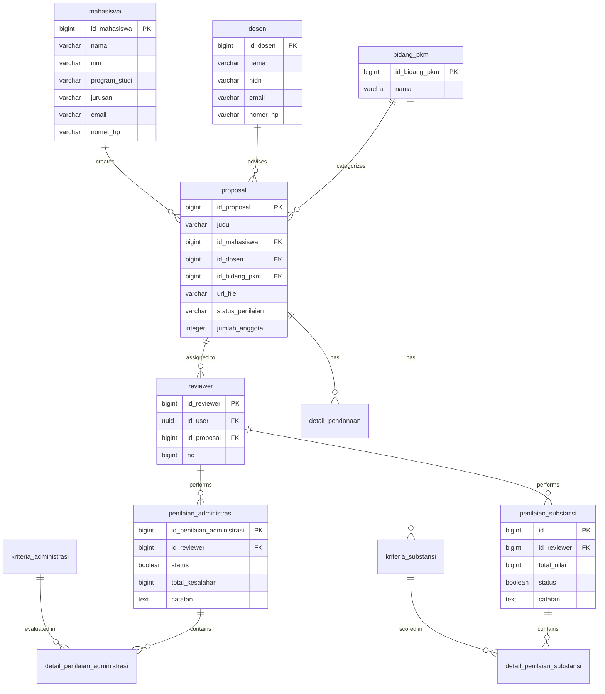

# Database Schema Documentation
## Old PKM Review System Database Structure

---

## Overview
This document describes the database schema extracted from the old PKM Review system backup. The database uses PostgreSQL and includes tables for managing students, reviewers, proposals, and assessments.

---

## Core Tables

### 1. **mahasiswa** (Students)
Stores student information.

| Column | Type | Constraints | Description |
|--------|------|-------------|-------------|
| `id_mahasiswa` | bigint | PRIMARY KEY, AUTO INCREMENT | Unique student ID |
| `nama` | varchar | | Student name |
| `nim` | varchar | | Student ID number |
| `program_studi` | varchar | | Study program |
| `jurusan` | varchar | | Department/Faculty |
| `nomer_hp` | varchar | | Phone number |
| `email` | varchar | | Email address |
| `created_at` | timestamp with time zone | NOT NULL, DEFAULT now() | Record creation timestamp |

---

### 2. **dosen** (Lecturers/Advisors)
Stores lecturer/advisor information.

| Column | Type | Constraints | Description |
|--------|------|-------------|-------------|
| `id_dosen` | bigint | PRIMARY KEY, AUTO INCREMENT | Unique lecturer ID |
| `nama` | varchar | | Lecturer name |
| `nidn` | varchar | | National Lecturer ID Number |
| `email` | varchar | | Email address |
| `nomer_hp` | varchar | | Phone number |
| `created_at` | timestamp with time zone | NOT NULL, DEFAULT now() | Record creation timestamp |

---

### 3. **bidang_pkm** (PKM Type/Category)
Stores PKM type information (PKM-RE, PKM-RSH, etc.).

| Column | Type | Constraints | Description |
|--------|------|-------------|-------------|
| `id_bidang_pkm` | bigint | PRIMARY KEY | Unique PKM type ID |
| `nama` | varchar | | PKM type name |
| `created_at` | timestamp with time zone | NOT NULL, DEFAULT now() | Record creation timestamp |

---

### 4. **proposal** (Proposals)
Stores proposal information.

| Column | Type | Constraints | Description |
|--------|------|-------------|-------------|
| `id_proposal` | bigint | PRIMARY KEY, AUTO INCREMENT | Unique proposal ID |
| `judul` | varchar | | Proposal title |
| `id_mahasiswa` | bigint | FOREIGN KEY → mahasiswa | Reference to student (team leader) |
| `id_dosen` | bigint | FOREIGN KEY → dosen | Reference to advisor |
| `url_file` | varchar | | File URL/path |
| `status_penilaian` | varchar | | Assessment status |
| `jumlah_anggota` | integer | | Number of team members |
| `id_bidang_pkm` | bigint | FOREIGN KEY → bidang_pkm | Reference to PKM type |
| `created_at` | timestamp with time zone | NOT NULL, DEFAULT now() | Record creation timestamp |

---

### 5. **reviewer** (Reviewer Assignment)
Links reviewers to proposals.

| Column | Type | Constraints | Description |
|--------|------|-------------|-------------|
| `id_reviewer` | bigint | PRIMARY KEY, AUTO INCREMENT | Unique reviewer assignment ID |
| `id_user` | uuid | FOREIGN KEY → auth.users | Reference to user account |
| `id_proposal` | bigint | FOREIGN KEY → proposal | Reference to proposal |
| `no` | bigint | | Reviewer number (1 or 2) |
| `created_at` | timestamp with time zone | NOT NULL, DEFAULT now() | Record creation timestamp |

---

## Assessment Tables

### 6. **kriteria_administrasi** (Administrative Criteria)
Stores administrative assessment criteria (checklist items).

| Column | Type | Constraints | Description |
|--------|------|-------------|-------------|
| `id_kriteria` | bigint | PRIMARY KEY, AUTO INCREMENT | Unique criteria ID |
| `deskripsi` | text | | Criteria description |
| `created_at` | timestamp with time zone | NOT NULL, DEFAULT now() | Record creation timestamp |

---

### 7. **kriteria_substansi** (Substantive Criteria)
Stores substantive assessment indicators with scoring.

| Column | Type | Constraints | Description |
|--------|------|-------------|-------------|
| `id_kriteria` | bigint | PRIMARY KEY, AUTO INCREMENT | Unique criteria ID |
| `id_bidang_pkm` | bigint | FOREIGN KEY → bidang_pkm | Reference to PKM type |
| `deskripsi` | text | | Criteria description |
| `bobot` | bigint | | Weight/score range |
| `created_at` | timestamp with time zone | NOT NULL, DEFAULT now() | Record creation timestamp |

---

### 8. **penilaian_administrasi** (Administrative Assessment)
Stores administrative assessment results by reviewer.

| Column | Type | Constraints | Description |
|--------|------|-------------|-------------|
| `id_penilaian_administrasi` | bigint | PRIMARY KEY, AUTO INCREMENT | Unique assessment ID |
| `id_reviewer` | bigint | FOREIGN KEY → reviewer | Reference to reviewer |
| `status` | boolean | | Assessment status (completed/incomplete) |
| `total_kesalahan` | bigint | | Total number of errors found |
| `catatan` | text | | Notes/comments |
| `created_at` | timestamp with time zone | NOT NULL, DEFAULT now() | Record creation timestamp |
| `updated_at` | timestamp with time zone | | Last update timestamp |

---

### 9. **detail_penilaian_administrasi** (Administrative Assessment Details)
Stores detailed checklist results for each criterion.

| Column | Type | Constraints | Description |
|--------|------|-------------|-------------|
| `id_detail_penilaian` | bigint | PRIMARY KEY, AUTO INCREMENT | Unique detail ID |
| `id_penilaian` | bigint | FOREIGN KEY → penilaian_administrasi | Reference to assessment |
| `id_kriteria` | bigint | FOREIGN KEY → kriteria_administrasi | Reference to criteria |
| `kesalahan` | boolean | | Error flag (true = has error) |
| `created_at` | timestamp with time zone | NOT NULL, DEFAULT now() | Record creation timestamp |

---

### 10. **penilaian_substansi** (Substantive Assessment)
Stores substantive assessment results by reviewer.

| Column | Type | Constraints | Description |
|--------|------|-------------|-------------|
| `id` | bigint | PRIMARY KEY, AUTO INCREMENT | Unique assessment ID |
| `id_reviewer` | bigint | FOREIGN KEY → reviewer | Reference to reviewer |
| `total_nilai` | bigint | | Total score |
| `status` | boolean | | Assessment status (completed/incomplete) |
| `catatan` | text | | Notes/comments |
| `created_at` | timestamp with time zone | NOT NULL, DEFAULT now() | Record creation timestamp |
| `updated_at` | timestamp without time zone | | Last update timestamp |

---

### 11. **detail_penilaian_substansi** (Substantive Assessment Details)
Stores detailed scoring for each criterion.

| Column | Type | Constraints | Description |
|--------|------|-------------|-------------|
| `id` | bigint | PRIMARY KEY, AUTO INCREMENT | Unique detail ID |
| `id_penilaian` | bigint | FOREIGN KEY → penilaian_substansi | Reference to assessment |
| `id_kriteria` | bigint | FOREIGN KEY → kriteria_substansi | Reference to criteria |
| `skor` | double precision | | Score value |
| `nilai` | bigint | | Calculated value |
| `created_at` | timestamp with time zone | NOT NULL, DEFAULT now() | Record creation timestamp |

---

### 12. **detail_pendanaan** (Funding Details)
Stores funding information for proposals.

| Column | Type | Constraints | Description |
|--------|------|-------------|-------------|
| `id` | bigint | PRIMARY KEY, AUTO INCREMENT | Unique funding detail ID |
| `id_proposal` | bigint | FOREIGN KEY → proposal | Reference to proposal |
| `dana_simbelmawa` | numeric | DEFAULT 0 | Funding from Simbelmawa |
| `dana_perguruan_tinggi` | numeric | DEFAULT 0 | Funding from university |
| `dana_pihak_lain` | numeric | DEFAULT 0 | Funding from other sources |
| `created_at` | timestamp with time zone | NOT NULL, DEFAULT now() | Record creation timestamp |

---

## Entity Relationship Diagram

---

## Key Observations

### Architecture Patterns
1. **User Management**: Uses Supabase auth schema for user authentication
2. **Assessment System**: Separates administrative (checklist) and substantive (scoring) assessments
3. **Reviewer Assignment**: Multiple reviewers can be assigned to one proposal via junction table
4. **Criteria Configuration**: Criteria are configurable and linked to PKM types

### Data Model Characteristics
1. **No Team Table**: The old system doesn't have explicit team management - only stores team leader (`id_mahasiswa`) and member count (`jumlah_anggota`)
2. **Single Proposal per Student**: One mahasiswa can create multiple proposals (1:N relationship)
3. **Dosen as Advisor**: `dosen` table represents advisors, stored as text data linked to proposals
4. **Reviewer = User**: Reviewers are linked to auth.users via UUID
5. **Status Tracking**: Uses `status_penilaian` varchar field (not enum)

### Missing Features (Compared to New PRD)
1. **No Team Management**: No team creation, join request, or member management
2. **No Team Members Table**: Can't track individual team members
3. **No Proposal Status Enum**: Uses varchar instead of controlled status values
4. **No File Versioning**: Only one `url_file` per proposal
5. **No PDF Annotations**: No table for storing highlights/comments on PDF
6. **No Toggle/Configuration Table**: No system configuration management
7. **No Program Studi/Jurusan Master Tables**: Stored as varchar in mahasiswa table
8. **No Template Management**: No table for proposal templates

---

## Comparison with New PRD Requirements

| Feature | Old System | New PRD Requirement |
|---------|-----------|---------------------|
| Team Management | ❌ Only team leader + count | ✅ Full team CRUD with members table |
| Team Join Workflow | ❌ Not supported | ✅ Request/accept mechanism |
| Proposal Status | ⚠️ Varchar field | ✅ Enum with workflow (Draft, Submitted, etc.) |
| File Management | ⚠️ Single URL | ✅ Multiple versions with history |
| PDF Annotations | ❌ Not supported | ✅ Highlight & comments with coordinates |
| Reviewer Visibility | ⚠️ Unknown | ✅ Blind review (reviewers can't see each other) |
| Admin Toggles | ❌ Not supported | ✅ Pengumpulan, Review, Upload Ulang toggles |
| Master Data | ⚠️ Partial (only bidang_pkm) | ✅ Full (Jurusan, Prodi, Jenis PKM) |
| Criteria Management | ✅ Supported | ✅ Enhanced with per-PKM-type config |

---

## Migration Considerations

### Tables to Migrate
1. ✅ **mahasiswa** → Enhanced with jurusan_id, prodi_id (FK to master tables)
2. ✅ **dosen** → Keep structure, add username field for reviewers
3. ✅ **proposal** → Add status enum, team_id FK, remove id_mahasiswa directly
4. ✅ **bidang_pkm** → Rename to jenis_pkm, keep structure
5. ✅ **kriteria_administrasi/substansi** → Enhance with jenis_pkm_id
6. ⚠️ **reviewer** → Keep but add assignment logic
7. ⚠️ **penilaian_administrasi/substansi** → Restructure to align with new review workflow

### New Tables Needed
1. ✅ **team** - Team management
2. ✅ **team_member** - Team membership
3. ✅ **proposal_file** - File versioning
4. ✅ **pdf_annotation** - PDF highlights/comments
5. ✅ **jurusan** - Department master data
6. ✅ **program_studi** - Study program master data
7. ✅ **system_config** - Toggle and configuration management
8. ✅ **proposal_template** - Optional template storage

### Data Transformation Required
1. Extract `jurusan` and `program_studi` from mahasiswa table → Create master data
2. Convert `status_penilaian` varchar → Status enum
3. Create team records from existing proposals (1 proposal = 1 team retroactively)
4. Convert `url_file` → Create proposal_file records

---

**Document Version**: 1.0  
**Extracted From**: db_old.backup (PostgreSQL dump)  
**Date**: 2026-02-02  
**Total Tables Analyzed**: 12 core tables + auth schema tables
