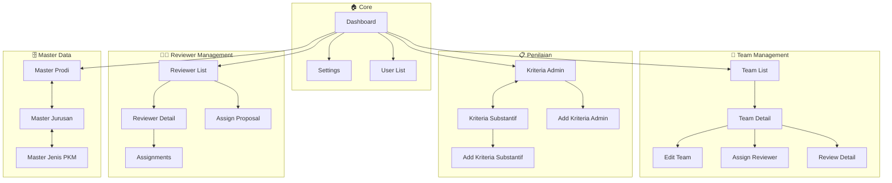
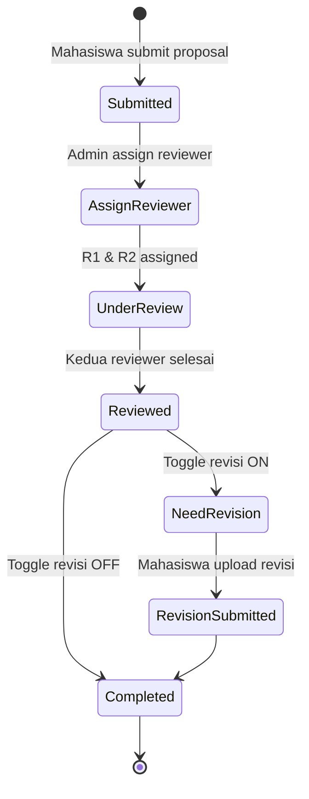

# Wireframe Admin - Dokumentasi

## 📋 Overview

Wireframe untuk role **Admin** dalam sistem PKM Review.  
Total: **20 halaman** dalam **4 phase** + 1 CSS shared.

---

## 🗺️ Sitemap

```
/admin
├── /dashboard                      → Dashboard
├── /settings                       → System Settings
├── /users                          → User Management
├── /teams
│   ├── (list)                      → Team List
│   └── /:teamId
│       ├── (detail)                → Team Detail
│       └── /edit                   → Edit Team
├── /penilaian
│   ├── /administratif              → Kriteria Admin
│   │   └── /tambah                 → Add Kriteria Admin
│   └── /substantif                 → Kriteria Substantif
│       └── /tambah                 → Add Kriteria Substantif
├── /reviewers
│   ├── (list)                      → Reviewer List
│   ├── /:reviewerId
│   │   ├── (detail)                → Reviewer Detail
│   │   └── /assignments            → Assignments
│   ├── /assign-reviewer            → Assign Reviewer ke Proposal
│   └── /assign-proposal            → Assign Proposal ke Reviewer
├── /reviews/:reviewId              → Review Detail
└── /master
    ├── /prodi                      → Master Prodi
    ├── /jurusan                    → Master Jurusan
    └── /pkm                        → Master Jenis PKM
```

---

## 📊 User Flow Diagram



---

## 📄 Daftar Halaman

### Phase 1: Core Pages 🔵

| # | Halaman | File | Route | Deskripsi |
|---|---------|------|-------|-----------|
| 1 | Dashboard | `dashboard.html` | `/admin/dashboard` | Stats overview, phase indicator |
| 2 | Settings | `settings.html` | `/admin/settings` | Phase control, history log |
| 3 | User List | `user-list.html` | `/admin/users` | Filter, search, activate/deactivate |

### Phase 2: Team & Penilaian 🟡

| # | Halaman | File | Route | Deskripsi |
|---|---------|------|-------|-----------|
| 4 | Team List | `team-list.html` | `/admin/teams` | Filter PKM/status, pagination |
| 5 | Team Detail | `team-detail.html` | `/admin/teams/:id` | Members, proposal, reviewers |
| 6 | Edit Team | `team-edit.html` | `/admin/teams/:id/edit` | Edit data, member management |
| 7 | Kriteria Admin | `kriteria-administratif.html` | `/admin/penilaian/admin` | Tab per PKM, checklist criteria |
| 8 | Kriteria Substantif | `kriteria-substantif.html` | `/admin/penilaian/substantif` | Tab per PKM, bobot % |
| 9 | Add Kriteria Admin | `add-kriteria-admin.html` | `/admin/penilaian/admin/tambah` | Chip PKM, wajib/opsional |
| 10 | Add Kriteria Substantif | `add-kriteria-substantif.html` | `/admin/penilaian/substantif/tambah` | Bobot, skor maksimal |

### Phase 3: Reviewer Management 🟠

| # | Halaman | File | Route | Deskripsi |
|---|---------|------|-------|-----------|
| 11 | Reviewer List | `reviewer-list.html` | `/admin/reviewers` | Stats, filter, assignments count |
| 12 | Reviewer Detail | `reviewer-detail.html` | `/admin/reviewers/:id` | Profile, statistics |
| 13 | Reviewer Assignments | `reviewer-assignments.html` | `/admin/reviewers/:id/assignments` | List penugasan |
| 14 | Assign Reviewer | `assign-reviewer.html` | `/admin/assign-reviewer` | Pilih R1/R2 untuk proposal |
| 15 | Assign Proposal | `assign-proposal.html` | `/admin/assign-proposal` | Batch assign ke reviewer |
| 16 | Review Detail | `review-detail.html` | `/admin/reviews/:id` | Hasil admin & substantif |

### Phase 4: Master Data 🟣

| # | Halaman | File | Route | Deskripsi |
|---|---------|------|-------|-----------|
| 17 | Master Prodi | `master-prodi.html` | `/admin/master/prodi` | CRUD prodi, filter jurusan |
| 18 | Master Jurusan | `master-jurusan.html` | `/admin/master/jurusan` | CRUD jurusan |
| 19 | Master Jenis PKM | `master-pkm.html` | `/admin/master/pkm` | CRUD PKM types |

### Support Files

| # | File | Deskripsi |
|---|------|-----------|
| 20 | `index.html` | Navigation hub - links ke semua halaman |
| - | `styles.css` | Shared CSS untuk semua halaman |

---

## 📊 Review Assignment Flow



---

## 🔗 File Structure

```
wireframes/admin/
├── pages/
│   ├── index.html              # Navigation index
│   ├── styles.css              # Shared styles
│   ├── dashboard.html
│   ├── settings.html
│   ├── user-list.html
│   ├── team-list.html
│   ├── team-detail.html
│   ├── team-edit.html
│   ├── kriteria-administratif.html
│   ├── kriteria-substantif.html
│   ├── add-kriteria-admin.html
│   ├── add-kriteria-substantif.html
│   ├── reviewer-list.html
│   ├── reviewer-detail.html
│   ├── reviewer-assignments.html
│   ├── assign-reviewer.html
│   ├── assign-proposal.html
│   ├── review-detail.html
│   ├── master-prodi.html
│   ├── master-jurusan.html
│   └── master-pkm.html
├── phase-1-core.html           # All-in-one Phase 1
├── phase-2-management.html     # All-in-one Phase 2
├── phase-3-reviewer.html       # All-in-one Phase 3
├── phase-4-master.html         # All-in-one Phase 4
└── DOCUMENTATION.md            # This file
```

---

## 📝 Catatan Penting

1. **Phase Control**: Admin mengontrol fase sistem (Submission/Review/Revision/Closed)
2. **Kriteria per PKM**: Kriteria admin & substantif berbeda untuk setiap jenis PKM
3. **Dual Reviewer**: Setiap proposal harus punya 2 reviewer (R1 & R2)
4. **Validation Rules**: Reviewer tidak boleh review proposal yang dibimbing
5. **Total Bobot 100%**: Kriteria substantif harus total bobotnya = 100%

---

*Dokumentasi terakhir diupdate: 8 Februari 2026*
