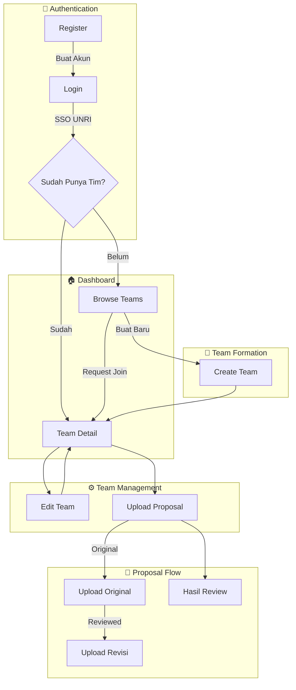
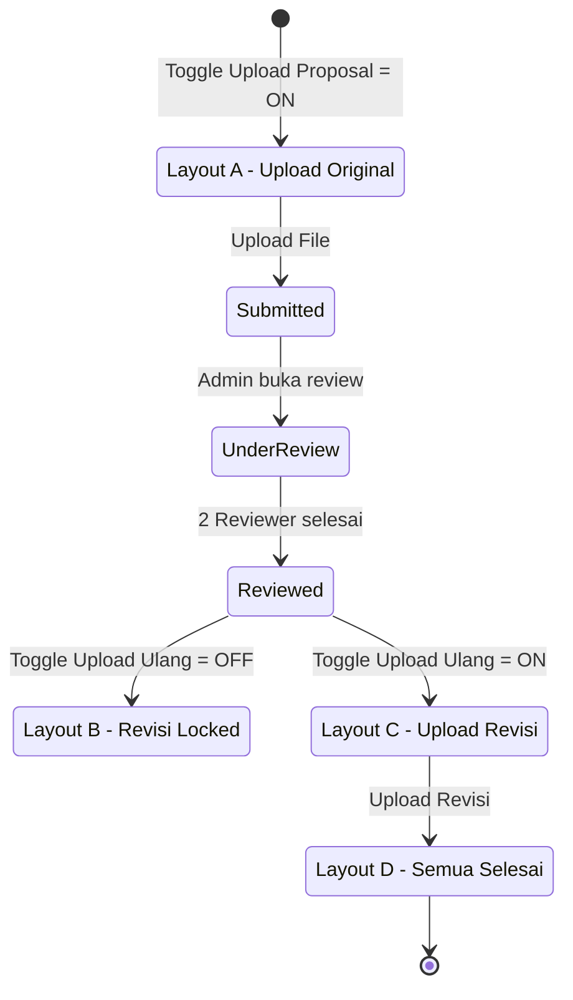

# Wireframe Mahasiswa - Dokumentasi

## 📋 Overview

Wireframe untuk role **Mahasiswa** dalam sistem PKM Review.  
Total: **9 halaman** dalam **4 phase**.

---

## 🗺️ Sitemap

```
/mahasiswa
├── /login                      → Login
├── /register                   → Registrasi
├── /dashboard                  → Dashboard (kondisional)
├── /teams
│   ├── /browse                 → Browse Teams
│   ├── /create                 → Create Team
│   └── /:teamId
│       ├── (detail)            → Team Detail
│       ├── /edit               → Edit Team
│       ├── /proposal           → Upload Proposal
│       └── /review-results     → Hasil Review
```

---

## 📊 User Flow Diagram



---

## 📄 Daftar Halaman

### Phase 1: Authentication & Dashboard 🔵

| # | Halaman | File | Route | Deskripsi |
|---|---------|------|-------|-----------|
| 1 | Login | `login.html` | `/login` | Login dengan SSO UNRI |
| 2 | Register | `register.html` | `/register` | Registrasi mahasiswa baru |
| 3 | Dashboard | `dashboard.html` | `/mahasiswa/dashboard` | Dashboard kondisional |

### Phase 2: Team Formation 🟡

| # | Halaman | File | Route | Deskripsi |
|---|---------|------|-------|-----------|
| 4 | Browse Teams | `browse-teams.html` | `/mahasiswa/teams/browse` | Cari & join tim |
| 5 | Create Team | `create-team.html` | `/mahasiswa/teams/create` | Buat tim baru |
| 6 | Team Detail | `team-detail.html` | `/mahasiswa/teams/:id` | Detail tim & anggota |

### Phase 3: Team Management 🟠

| # | Halaman | File | Route | Deskripsi |
|---|---------|------|-------|-----------|
| 7 | Edit Team | `edit-team.html` | `/mahasiswa/teams/:id/edit` | Edit data tim |
| 8 | Upload Proposal | `upload-proposal.html` | `/mahasiswa/teams/:id/proposal` | Upload original & revisi |

### Phase 4: Review Results 🟣

| # | Halaman | File | Route | Deskripsi |
|---|---------|------|-------|-----------|
| 9 | Hasil Review | `review-results.html` | `/mahasiswa/teams/:id/results` | Lihat penilaian |

---

## 📤 Upload Proposal - State Diagram



### Penjelasan Layout:

| Layout | Kondisi | Aksi |
|--------|---------|------|
| **A** | Toggle Upload Proposal = ON, belum upload | Upload proposal original |
| **B** | Original reviewed, Toggle Upload Ulang = OFF | Lihat hasil review, revisi locked |
| **C** | Original reviewed, Toggle Upload Ulang = ON | Upload proposal revisi |
| **D** | Kedua proposal sudah upload | Lihat kedua proposal |

---

## 📊 Sistem Penilaian

### Penilaian Administratif
- Mahasiswa melihat **daftar kriteria yang salah**
- Setiap kesalahan berisi: nama kriteria + penjelasan
- Catatan reviewer (opsional)

### Penilaian Substantif
- Tabel perhitungan lengkap
- Format: Kriteria | Bobot | Skor | Nilai
- Rumus: **Nilai = Bobot × Skor**
- Total Bobot = 100

> ⚠️ Kedua penilaian ditampilkan **TERPISAH** (tidak ada total gabungan)

---

## 🔗 File Structure

```
wireframes/mahasiswa/
├── pages/
│   ├── index.html              # Navigation index
│   ├── styles.css              # Shared styles
│   ├── login.html
│   ├── register.html
│   ├── dashboard.html
│   ├── browse-teams.html
│   ├── create-team.html
│   ├── team-detail.html
│   ├── edit-team.html
│   ├── upload-proposal.html
│   └── review-results.html
├── phase-1-auth-dashboard.html # All-in-one Phase 1
├── phase-2-team-formation.html # All-in-one Phase 2
├── phase-3-team-management.html # All-in-one Phase 3
├── phase-4-review-results.html # All-in-one Phase 4
└── DOCUMENTATION.md            # This file
```

---

## 📝 Catatan Penting

1. **One Team Rule**: Mahasiswa hanya boleh bergabung dengan **1 tim** per periode
2. **Dosen Pembimbing Wajib**: Harus diisi sebelum upload proposal
3. **Proposal Original → Dire-review**, **Proposal Revised → Dokumentasi saja**
4. **Toggle-based**: Fitur upload dikontrol oleh admin via toggle

---

*Dokumentasi terakhir diupdate: 8 Februari 2026*
