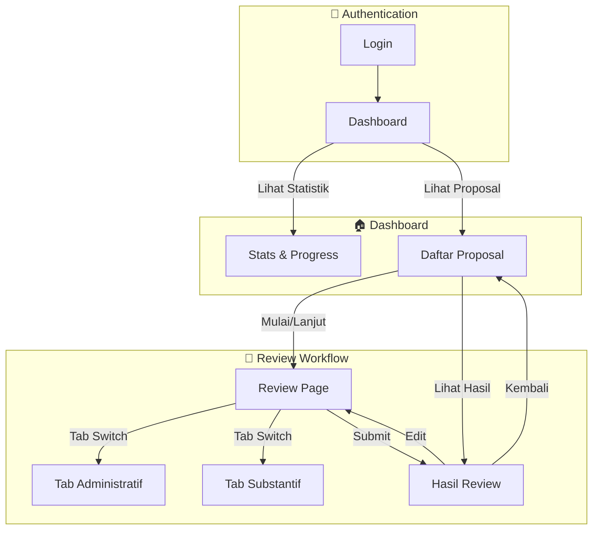

# Wireframe Reviewer - Dokumentasi

## 📋 Overview

Wireframe untuk role **Reviewer** dalam sistem PKM Review.  
Total: **5 halaman** dalam **2 phase**.

---

## 🗺️ Sitemap

```
/reviewer
├── /login                      → Login Reviewer
├── /dashboard                  → Dashboard + Statistik
├── /proposals                  → Daftar Proposal Assigned
├── /proposals/:id/review       → Review Page (PDF + Form)
│   ├── Tab: Administratif      → Checklist kesalahan
│   └── Tab: Substantif         → Scoring table
└── /proposals/:id/summary      → Hasil Review (Read-only)
```

---

## 📊 User Flow Diagram



---

## 📄 Daftar Halaman

### Phase 1: Core 🔵

| # | Halaman | File | Route | Deskripsi |
|---|---------|------|-------|-----------|
| 1 | Login | `login.html` | `/reviewer/login` | Login dengan kredensial dari admin |
| 2 | Dashboard | `dashboard.html` | `/reviewer/dashboard` | Statistik, progress, preview proposal |

### Phase 2: Review Workflow 🟡

| # | Halaman | File | Route | Deskripsi |
|---|---------|------|-------|-----------|
| 3 | Daftar Proposal | `proposal-list.html` | `/reviewer/proposals` | Filter, search, list proposal |
| 4 | Review Proposal | `review-page.html` | `/reviewer/proposals/:id/review` | PDF viewer + form penilaian |
| 5 | Hasil Review | `review-summary.html` | `/reviewer/proposals/:id/summary` | Read-only hasil setelah submit |

---

## 🔗 File Structure

```
wireframes/reviewer/
├── pages/
│   ├── index.html              # Navigation hub
│   ├── styles.css              # Shared styles (orange theme)
│   ├── login.html
│   ├── dashboard.html
│   ├── proposal-list.html
│   ├── review-page.html
│   └── review-summary.html
├── phase-1-core.html           # All-in-one Phase 1
├── phase-2-review.html         # All-in-one Phase 2
└── DOCUMENTATION.md            # This file
```

---

## 🎨 Design Theme

| Aspek | Spesifikasi |
|-------|-------------|
| **Primary Color** | Orange (#f57c00) |
| **Gradient** | #f57c00 → #e65100 |
| **Status Colors** | Green (selesai), Orange (sedang), Gray (belum), Red (error) |

---

## 📝 Catatan Penting

1. **Blind Review**: Reviewer tidak bisa melihat review dari reviewer lain
2. **Toggle-based**: Fitur review dikontrol admin via toggle fase
3. **Editable**: Review dapat diedit selama fase review **DIBUKA**
4. **Final**: Setelah admin tutup fase, review menjadi **FINAL**
5. **Dual Assessment**: Penilaian Administratif (checklist) + Substantif (scoring)
6. **Formula**: Nilai = Bobot × Skor (Total bobot = 100)

---

## 📊 Penilaian

### Administratif
- Sistem checklist kesalahan
- Reviewer centang item yang **BERMASALAH**
- Auto-count total kesalahan
- Mahasiswa hanya lihat jumlah (bukan detail item)

### Substantif  
- Tabel scoring dengan bobot per kriteria
- Skala: 1-7 (1=Buruk, 7=Sangat Baik)
- Nilai = Bobot × Skor
- Total nilai = SUM(semua nilai)

---

*Dokumentasi terakhir diupdate: 8 Februari 2026*
